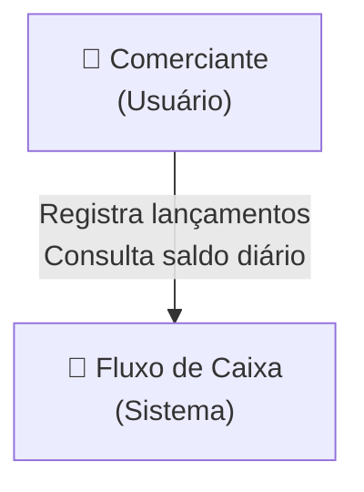
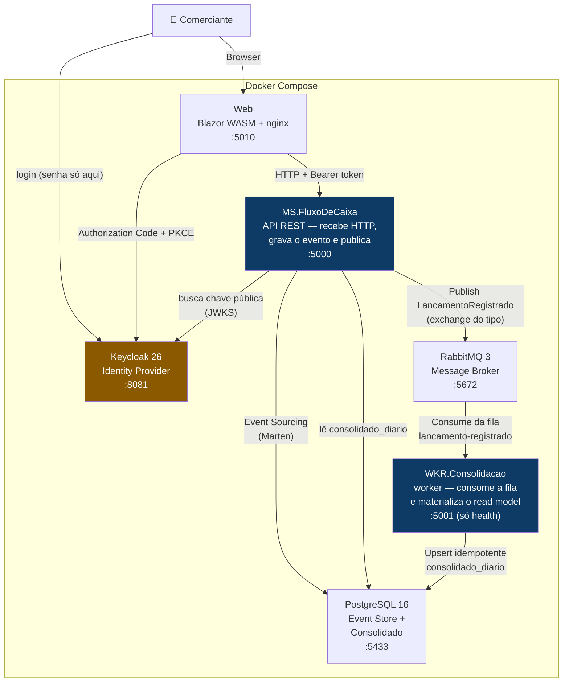
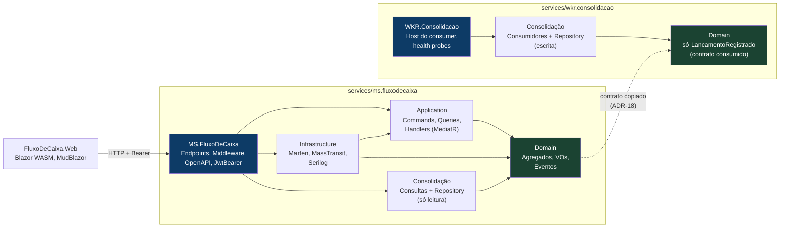
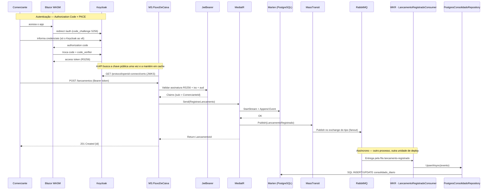
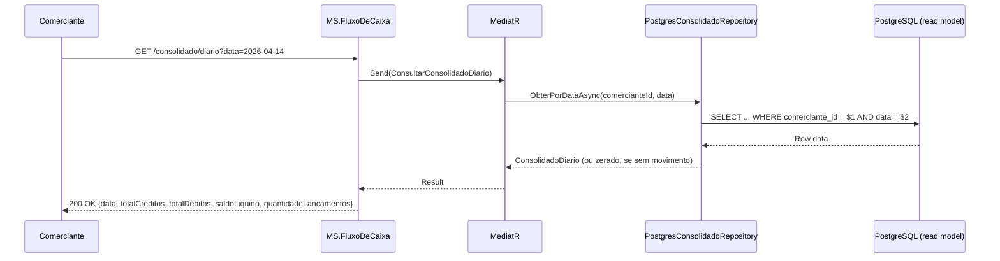

# Arquitetura — Fluxo de Caixa

Documento técnico com diagramas e decisões arquiteturais do sistema de controle de fluxo de caixa diário.

O sistema utiliza **Event Sourcing** com Marten sobre PostgreSQL, **CQRS** via MediatR, e **RabbitMQ** (MassTransit) para desacoplamento entre o registro de lançamentos e a consolidação diária.

---

## Visão Geral (C4 — Contexto)

O comerciante interage com o sistema para registrar lançamentos e consultar o saldo consolidado diário.



---

## Diagrama de Containers (C4 — Container)

O sistema roda em 6 containers Docker orquestrados via Docker Compose:



> **Dois processos, de propósito (ADR-15).** O MS publica e o WKR consome — não há chamada direta entre eles. Derrubar o worker não afeta o registro de lançamentos: as mensagens ficam retidas na fila e são processadas quando ele volta. É o requisito não-funcional do desafio garantido pela topologia, não apenas pelo protocolo.

**Detalhes dos containers:**

| Container | Imagem | Porta | Função |
|---|---|---|---|
| `web` | Build local (Dockerfile) | 5010:80 | Blazor WASM SPA servido por nginx |
| `ms.fluxodecaixa` | Build local (Dockerfile) | 5000:8080 | API REST + escrita no event store + publicação do evento |
| `wkr.consolidacao` | Build local (Dockerfile) | 5001:8080 | Worker que consome a fila e materializa o consolidado (só probes de saúde) |
| `keycloak` | quay.io/keycloak/keycloak:26.0 | 8081:8080 | Identity Provider — realm importado de `keycloak/realm-fluxocaixa.json` |
| `postgres` | postgres:16-alpine | 5433:5432 | Event Store (Marten) + Tabela consolidado_diario |
| `rabbitmq` | rabbitmq:3-management | 5672 + 15672 | Broker de mensagens + Management UI |

> A porta **8081** foi escolhida em vez da 8080 padrão do Keycloak para não colidir com aplicações já em execução na máquina do avaliador.

---

## Camadas da Aplicação (Clean Architecture)

As dependências fluem de fora para dentro. A camada Domain não depende de nada externo.

Cada serviço tem a **sua própria árvore de projetos** sob `services/<serviço>/src/`. Não há biblioteca compartilhada entre MS e worker: o grafo de compilação de cada um contém exatamente o que ele executa, e nada além disso (ADR-15, ADR-18).



> **As setas cheias indicam dependência de compilação.** Domain não depende de nada (camada mais interna). Não há nenhuma seta cruzando as duas árvores: em tempo de execução os processos só se encontram pelo RabbitMQ, e em tempo de compilação não se encontram de forma alguma.
>
> A única linha entre as árvores é **tracejada e não é uma referência** — é a cópia do contrato `LancamentoRegistrado`, mantida em sincronia por disciplina e por teste, não pelo compilador (ADR-18).

**A Consolidação aparece nas duas árvores, mas cada cópia carrega metade do CQRS:**

| | MS | Worker |
|---|---|---|
| `Consultas/` | ✅ `ConsultarConsolidadoDiario` | — |
| `Consumidores/` | — | ✅ `LancamentoRegistradoConsumer` |
| `Repositorios/` | ✅ usado para `SELECT` | ✅ usado para `UPSERT` |

Um processo **lê** o read model, o outro o **escreve**. O nome do projeto é o mesmo por conveniência, mas o conteúdo compilado em cada serviço não é.

### Mapeamento para projetos .NET

**`services/ms.fluxodecaixa`** — API REST, escrita no event store e leitura do consolidado:

| Projeto | Papel | Dependências NuGet |
|---|---|---|
| `MS.FluxoDeCaixa` | Host — endpoints, middleware, autenticação | Microsoft.AspNetCore.OpenApi, JwtBearer, Npgsql |
| `FluxoDeCaixa.Application` | Commands, Queries, Handlers | MediatR, FluentValidation |
| `FluxoDeCaixa.Infrastructure` | Event store e publicação | Marten, MassTransit.RabbitMQ, Serilog |
| `FluxoDeCaixa.Consolidacao` | Consulta ao read model | Npgsql |
| `FluxoDeCaixa.Domain` | Agregados, value objects, eventos | Nenhuma (pure C#) |

**`services/wkr.consolidacao`** — consome a fila e materializa o read model:

| Projeto | Papel | Dependências NuGet |
|---|---|---|
| `WKR.Consolidacao` | Host — consumer e probes de saúde | MassTransit.RabbitMQ, Npgsql, Serilog |
| `FluxoDeCaixa.Consolidacao` | Consumer e escrita idempotente | MassTransit.RabbitMQ, Npgsql |
| `FluxoDeCaixa.Domain` | Apenas o contrato `LancamentoRegistrado` | Nenhuma (pure C#) |

**`services/fluxodecaixa.web`** — SPA servida por nginx:

| Projeto | Papel | Dependências NuGet |
|---|---|---|
| `FluxoDeCaixa.Web` | Blazor WebAssembly | MudBlazor, Components.WebAssembly(.Authentication) |

> O worker **não referencia** `FluxoDeCaixa.Infrastructure`. Ele não toca no event store — só materializa o read model — e a Infrastructure traria o Marten junto, com sua configuração de schema e conexão, para um processo que jamais o chamaria. Menos imagem, menos superfície de CVE, menos motivos para recompilar.
>
> Pelo mesmo critério, o `FluxoDeCaixa.Domain` do worker tem **um** arquivo: agregados e value objects pertencem a quem valida regra de negócio, e o worker não valida — ele consolida o que já foi validado do outro lado.

> As bibliotecas mantêm o prefixo `FluxoDeCaixa.*` porque não são unidades de deploy; os hosts implantáveis levam o prefixo do seu papel — `MS.*` para o microsserviço, `WKR.*` para o worker.

---

## Fluxo de Registro de Lançamento (Sequência)

`POST /lancamentos` — Escrita com Event Sourcing e publicação assíncrona:



**Padrão Persist-then-Publish:**
1. Marten persiste o evento no PostgreSQL (source of truth)
2. MassTransit publica no exchange do tipo `LancamentoRegistrado` no RabbitMQ (best-effort). O `Publish` não endereça fila nem serviço: quem cria a fila `lancamento-registrado` e a liga a esse exchange é o próprio worker, no `ConfigureEndpoints`
3. O `WKR.Consolidacao` consome dessa fila, em outro processo, e faz upsert idempotente em `consolidado_diario`. Com o worker fora do ar as mensagens ficam retidas na fila durável — o `POST /lancamentos` continua respondendo 201

---

## Fluxo de Consulta de Saldo (Sequência)

`GET /consolidado/diario?data=YYYY-MM-DD` — Leitura direta da tabela materializada:



**Separação de leitura e escrita (CQRS):**
- Escrita: Event Sourcing via Marten (append-only), no `MS.FluxoDeCaixa`
- Leitura: Tabela `consolidado_diario` com Npgsql (SELECT por chave primária), também servida pelo MS
- Quem **popula** essa tabela é o `WKR.Consolidacao`, fora deste fluxo. A consulta não depende do worker estar de pé: ela lê a última versão materializada. Se o worker estiver atrasado, o saldo fica temporariamente defasado — consistência eventual, assumida no ADR-04 — mas a consulta nunca falha por causa dele

**Isolamento multi-inquilino:** o `ComercianteId` vem da claim `sub` do JWT e nunca do body ou da query string. A chave primária `(comerciante_id, data)` garante o isolamento no nível do schema — ver ADR-03.

**Dia sem movimento:** responde `200` com zeros, não `404`. Ausência de lançamento é uma resposta de negócio válida; `404` significaria "recurso inexistente", o que confundiria o consumidor.

---

## Decisões Arquiteturais (ADRs)

### ADR-01: Event Sourcing com Marten (não EF Core)

- **Status:** Aceita
- **Contexto:** Precisamos persistir lançamentos financeiros com rastreabilidade completa. Cada lançamento é um fato imutável que não deve ser alterado.
- **Decisão:** Usar Marten como event store + document store sobre PostgreSQL. Eventos são a fonte de verdade (append-only).
- **Consequências:**
  - ✅ Imutabilidade garantida — eventos nunca são alterados
  - ✅ PostgreSQL como único banco — Marten gerencia o schema do event store
  - ✅ Snapshot inline para queries imediatas após escrita
  - ⚠️ `EventAppendMode.Quick` obrigatório para evitar event skipping sob carga

### ADR-02: RabbitMQ para desacoplamento (MassTransit)

- **Status:** Aceita
- **Contexto:** A consolidação diária não pode afetar a disponibilidade do registro de lançamentos. Se o serviço de consolidação cair, o registro de lançamentos deve continuar operando normalmente.
- **Decisão:** MassTransit + RabbitMQ com consumer assíncrono (`LancamentoRegistradoConsumer`). Comunicação via mensagem `LancamentoRegistrado`.
- **Consequências:**
  - ✅ Desacoplamento total — lançamentos funcionam mesmo sem consumer
  - ✅ Retry automático com backoff: 500ms → 2s → 10s
  - ✅ Error queue para mensagens que falharam após retries
  - ⚠️ Eventual consistency — saldo consolidado pode ter delay de < 1s

### ADR-03: Tabela separada consolidado_diario, escopada por comerciante

- **Status:** Aceita
- **Contexto:** O consolidado diário precisa de queries simples e performáticas (50 req/s). Marten projections adicionariam complexidade desnecessária para um read model simples. Além disso, o sistema é multi-inquilino: o consolidado de um comerciante jamais pode se misturar ao de outro.
- **Decisão:** Tabela PostgreSQL `consolidado_diario` com Npgsql raw SQL e **chave primária composta `(comerciante_id, data)`**. UPSERT atômico via `INSERT ON CONFLICT`. Toda leitura é escopada pelo `ComercianteId` extraído da claim `sub` do JWT — nunca por parâmetro de entrada.
- **Consequências:**
  - ✅ Performance previsível — SELECT direto por chave primária, sem agregação em tempo de consulta
  - ✅ Isolamento multi-inquilino garantido no nível do schema, não só no código
  - ✅ Schema explícito — `NUMERIC(19,2)` para valores monetários
  - ✅ UPSERT atômico — sem race conditions na atualização
  - ⚠️ Mesma instância PostgreSQL que o Marten (simplificação para o desafio; a arquitetura alvo usa read replica dedicada)


### ADR-04: Persist-then-Publish

- **Status:** Aceita
- **Contexto:** Precisamos garantir que o evento está salvo antes de publicar no RabbitMQ. Em caso de falha na publicação, o evento deve estar persistido.
- **Decisão:** Marten persiste o evento primeiro (source of truth), MassTransit publica no RabbitMQ segundo (best-effort).
- **Consequências:**
  - ✅ Evento sempre persiste — nunca se perde
  - ✅ Simplicidade — sem outbox pattern
  - ⚠️ Se RabbitMQ estiver indisponível, o evento está salvo mas o consolidado não é atualizado imediatamente
  - ⚠️ Consumer pode ser reproduzido a partir do event store se necessário

### ADR-05: CQRS com MediatR

- **Status:** Aceita
- **Contexto:** Separar claramente operações de escrita (comandos) e leitura (consultas) para manter o código organizado e testável.
- **Decisão:** MediatR com pipeline behaviors para validação (FluentValidation). Cada comando/consulta tem seu handler isolado.
- **Consequências:**
  - ✅ Handlers isolados e testáveis (unit tests com NSubstitute)
  - ✅ Pipeline de validação transparente — `ValidationBehavior<TRequest, TResponse>`
  - ✅ CQRS explícito no código — `RegistrarLancamento` (command), `ConsultarLancamentos` (query)
  - ⚠️ Overhead de abstração — aceitável para demonstrar padrão arquitetural

### ADR-06: Dinheiro (Money) Value Object

- **Status:** Aceita
- **Contexto:** Valores financeiros precisam de precisão decimal e operações seguras. `decimal` puro não carrega semântica de negócio.
- **Decisão:** `readonly record struct Dinheiro` com `decimal Valor` e operator overloading para operações aritméticas.
- **Consequências:**
  - ✅ Imutabilidade — record struct com semântica de valor
  - ✅ Precisão decimal — evita erros de arredondamento
  - ✅ Operações type-safe — `+`, `-`, comparação
  - ✅ PostgreSQL `NUMERIC(19,2)` na persistência

### ADR-07: Keycloak como Identity Provider (OIDC)

- **Status:** Aceita
- **Contexto:** É preciso identificar comerciantes e isolar seus dados. A alternativa óbvia — autenticar na própria API, com tabela `usuarios`, hash BCrypt e JWT assinado com segredo simétrico (HS256) — é barata de escrever e cara de manter, por quatro razões estruturais: **(1)** não há revogação, então um token roubado vale até expirar; **(2)** HS256 exige compartilhar a chave *que assina* com qualquer parceiro que precise validar o token, o que inviabiliza integração externa; **(3)** não há MFA, política de senha nem recuperação de conta sem construir cada uma; **(4)** a aplicação passa a guardar credenciais, ampliando o raio de um vazamento.

  Nenhum desses pontos é corrigível sem trocar a decisão de base, porque todos decorrem de a aplicação ser a autoridade de identidade. E identidade é uma **capacidade genérica** ([DOMINIOS-E-CAPACIDADES.md](docs/DOMINIOS-E-CAPACIDADES.md)): não é onde este negócio se diferencia. Construir seria dívida assumida na origem; a decisão correta é comprar.

- **Decisão:** Delegar identidade ao **Keycloak 26**, com um realm versionado no repositório (`keycloak/realm-fluxocaixa.json`) e importado no boot — nenhuma configuração manual.
  - **Frontend** (`fluxocaixa-web`): cliente público, **Authorization Code + PKCE (S256)**. Sem client secret e sem ROPC. A senha do comerciante é digitada na página do Keycloak e nunca transita pelo nosso código.
  - **API** (`fluxocaixa-api`): *resource server*. Valida assinatura **RS256** contra o JWKS do realm; não emite token, não guarda senha e não tem tabela de usuários.
  - **Automação** (`fluxocaixa-testes`): cliente separado com *direct grant*, exclusivo para testes de integração e carga — mantém ROPC fora do cliente do browser.
  - O `sub` do token é o `ComercianteId`, extraído em `ClaimsPrincipalExtensions.ObterComercianteId()` e usado para escopar toda consulta e todo comando.

- **Consequências:**
  - ✅ **Zero credencial na aplicação** — não há tabela `usuarios`, não há BCrypt, não há segredo de assinatura
  - ✅ **RS256 com JWKS** — um parceiro valida o token sem jamais receber a chave privada; destrava integração externa
  - ✅ **Revogação real** — token de 15 min + sessão gerenciada pelo IdP; logout encerra a sessão no Keycloak, não só no browser
  - ✅ **MFA, política de senha, brute-force protection e recuperação de conta** vêm de graça e por configuração
  - ✅ **Audiência validada** — um token emitido para outro cliente do realm não é aceito pela API
  - ⚠️ **Nova dependência de runtime** — se o Keycloak cair, ninguém *autentica*; tokens já emitidos seguem válidos até expirar. Em produção: cluster multi-AZ com PostgreSQL dedicado
  - ⚠️ **Mais um container** no ambiente local (~500 MB, ~40 s de boot)
  - ⚠️ `start-dev` usa H2 e HTTP puro — adequado só para o ambiente local

- **Detalhe de implementação que vale registrar:** dentro do Docker, browser e API alcançam o Keycloak por hostnames diferentes (`localhost:8081` vs `keycloak:8080`), mas o claim `iss` precisa ser único. Resolvido com `KC_HOSTNAME` fixando o issuer público e `KC_HOSTNAME_BACKCHANNEL_DYNAMIC=true` permitindo que o `jwks_uri` resolva pela rota interna — na API, `Authority` (issuer) e `MetadataAddress` (descoberta) são configurados separadamente.

### ADR-08: Blazor WebAssembly + MudBlazor

- **Status:** Aceita
- **Contexto:** Necessário fornecer uma interface web para o desafio. A UI deve consumir a API REST existente e rodar inteiramente no browser.
- **Decisão:** Blazor WebAssembly (standalone) com MudBlazor como biblioteca de componentes UI. Servido por nginx em container Docker separado (porta 5010). Comunicação com a API via `HttpClient` configurado com base address.
- **Consequências:**
  - ✅ SPA sem servidor — todo o código roda no browser (WebAssembly)
  - ✅ Material Design — MudBlazor fornece componentes prontos e responsivos
  - ✅ Mesmo ecossistema .NET — compartilha modelos e lógica com o backend
  - ⚠️ Tamanho do download inicial — mitigado com gzip para DLLs WASM via nginx

### ADR-09: Categorias Predefinidas de Lançamento

- **Status:** Aceita
- **Contexto:** Lançamentos financeiros precisam ser categorizados para facilitar a análise e geração de relatórios pelo comerciante.
- **Decisão:** 8 categorias predefinidas modeladas como constantes estáticas na camada Domain (`CategoriaDeLancamento`). Validação no backend garante que apenas categorias válidas são aceitas.
- **Consequências:**
  - ✅ Domain-driven — categorias definidas como conceito de domínio, não como enum de banco
  - ✅ Validação centralizada — backend rejeita categorias inválidas
  - ✅ Extensível — novas categorias adicionadas sem migration de banco
  - ⚠️ Alterações requerem deploy — aceitável para o contexto do desafio

### ADR-10: Inbox de idempotência no consumer

- **Status:** Aceita
- **Contexto:** A entrega do RabbitMQ é *at-least-once*, e o MassTransit ainda faz retry (500ms/2s/10s por ADR-02). O consumer aplica `total = total + valor`, uma operação **não idempotente**. Uma reentrega após falha transitória do banco somaria o mesmo lançamento duas vezes — em um razão financeiro, dinheiro criado do nada, de forma permanente e silenciosa.
- **Decisão:** Tabela `lancamentos_consolidados` com chave primária no `LancamentoId`, funcionando como inbox. O `UPSERT` do consolidado só executa se o `INSERT` no inbox inserir de fato — as duas operações rodam em um único comando SQL (CTE), portanto na mesma transação implícita.
- **Consequências:**
  - ✅ Reprocessar a mesma mensagem N vezes produz exatamente o mesmo saldo
  - ✅ Habilita retry agressivo e reprocessamento da error queue sem medo
  - ✅ Sem custo de latência relevante — o inbox é um INSERT por chave primária
  - ⚠️ A tabela cresce junto com o volume de lançamentos; exige rotina de expurgo por janela (ex.: 30 dias) em produção
- **Verificado por:** `IdempotenciaConsolidadoTests`

### ADR-11: Configuração de identidade sem fallback em código

- **Status:** Aceita
- **Contexto:** É comum embutir um valor padrão para que a aplicação suba sem configuração. Quando esse valor é um segredo de assinatura, qualquer deploy desconfigurado passa a assinar tokens com uma chave que está no repositório público — e quem tem a chave forja um token para qualquer comerciante. Com o Keycloak (ADR-07) não há mais segredo de assinatura na aplicação, mas o princípio permanece: um `Authority` errado significa aceitar tokens de um emissor que não é o nosso.
- **Decisão:** Nenhum fallback no código. A API valida `Keycloak:Authority` na inicialização e **falha ao subir** se estiver ausente. `RequireHttpsMetadata` tem padrão `true` e só é desligado explicitamente no ambiente local.
- **Consequências:**
  - ✅ Impossível rodar aceitando tokens de um emissor não intencional
  - ✅ A falha acontece no boot, não como vulnerabilidade silenciosa em produção
  - ✅ A chave privada nunca esteve na aplicação — vive no Keycloak, e a API só lê a pública via JWKS
  - ⚠️ Exige configuração explícita em todo ambiente — é o objetivo, não um efeito colateral

---

## Decisões da Arquitetura Alvo e da Topologia de Serviços (ADR-12 a ADR-18)

Os ADRs acima descrevem o que está **implementado** e roda em `docker compose`. Os que seguem descrevem a **arquitetura alvo em nuvem** — decisões de plataforma que não fazem sentido exercitar no escopo do desafio, mas que definem o desenho de produção. O diagrama correspondente está em [docs/ARQUITETURA-ALVO.md](docs/ARQUITETURA-ALVO.md); o mapa de como todas as decisões se relacionam, em [docs/DECISOES-ARQUITETURAIS.md](docs/DECISOES-ARQUITETURAIS.md).

### ADR-12: Segregação em múltiplas contas AWS

- **Status:** Proposta (arquitetura alvo)
- **Contexto:** Colocar tudo em uma conta única mistura o que é **capacidade corporativa** (identidade, observabilidade — compartilhadas por vários domínios) com o que é **capacidade de domínio** (fluxo de caixa). Isso dilui a fronteira de responsabilidade, dificulta atribuir custo por domínio e faz um incidente em um domínio poder afetar os demais.
- **Decisão:** Duas contas em `sa-east-1`:
  - **Conta Share Enterprise** (`vpc-share-prod-sa-east-1`) — serviços corporativos: Keycloak como IdP da organização e a plataforma de observabilidade.
  - **Conta Domínio Fluxo de Caixa** (`vpc-fluxocaixa-prod-sa-east-1`) — tudo que pertence a este domínio: API Gateway, microsserviço, worker, PostgreSQL, RabbitMQ e Secrets Manager.
- **Consequências:**
  - ✅ **Blast radius** contido — um comprometimento no domínio não alcança o IdP corporativo
  - ✅ Custo atribuível por domínio sem rateio artificial
  - ✅ A fronteira de conta reforça a fronteira de *bounded context* ([DOMINIOS-E-CAPACIDADES.md](docs/DOMINIOS-E-CAPACIDADES.md))
  - ✅ Times diferentes operam contas diferentes, com IAM independente
  - ⚠️ Exige conectividade explícita entre contas (ADR-17) e governança de *landing zone*
  - ⚠️ Mais superfície operacional: duas contas para monitorar, versionar e auditar

### ADR-13: Keycloak como IdP corporativo compartilhado

- **Status:** Proposta (arquitetura alvo) — *evolui o [ADR-07](#adr-07-keycloak-como-identity-provider-oidc)*
- **Contexto:** No ambiente local, o Keycloak sobe como container do próprio projeto. Isso é adequado para o desafio, mas replicar um IdP por aplicação em produção multiplica custo, esforço de operação e — pior — **fragmenta a identidade**: o mesmo funcionário teria contas diferentes por sistema, e não haveria SSO nem visão única de acesso.
- **Decisão:** Promover o Keycloak a **serviço corporativo** na conta Share Enterprise, consumido por todos os domínios. O Fluxo de Caixa deixa de hospedar o IdP e passa a ser apenas mais um *resource server* registrado nele, com seu próprio realm ou client.
- **Consequências:**
  - ✅ **SSO real** entre os sistemas da organização
  - ✅ Política de senha, MFA e revogação definidas uma vez, valendo para todos
  - ✅ Custo do IdP rateado entre domínios, não duplicado
  - ✅ **Nada muda no código** — a aplicação só aponta `Keycloak:Authority` para outro host. É o retorno concreto de ter usado OIDC padrão em vez de autenticação própria
  - ⚠️ O IdP vira dependência crítica compartilhada: precisa de HA multi-AZ e de um time dono
  - ⚠️ Mudança no realm afeta vários domínios — exige processo de governança

### ADR-14: API Gateway como ponto único de entrada, com mTLS para o legado

- **Status:** Proposta (arquitetura alvo)
- **Contexto:** O enunciado do desafio pede **critérios de segurança para consumo (integração) de serviços**. Um sistema legado on-premises precisa consumir a API, e autenticá-lo por senha ou API key seria frágil: chave estática vaza, não expira e não identifica a máquina de origem.
- **Decisão:** Todo tráfego externo entra pelo `APG.FluxoCaixa`. Para o legado, **mTLS**: o cliente apresenta certificado emitido por uma CA privada, e o gateway valida contra um **CA TrustStore** (bucket S3). O gateway concentra ainda *throttling*, validação do token OIDC e registro de auditoria.
- **Consequências:**
  - ✅ **Autenticação mútua** — o legado prova quem é por certificado, não por segredo compartilhado
  - ✅ Revogação por certificado, sem alterar a aplicação
  - ✅ Rate limiting na borda resolve a limitação do limitador por instância anotada em [SEGURANCA.md](docs/SEGURANCA.md)
  - ✅ O microsserviço não fica exposto: só o gateway tem rota de entrada
  - ⚠️ Gestão de ciclo de vida de certificados (emissão, rotação, revogação) passa a ser responsabilidade operacional
  - ⚠️ O gateway vira ponto único de falha — exige HA e configuração versionada

### ADR-15: Separação de MS e WKR em serviços com deploy independente

- **Status:** ✅ **Implementada** — *concretiza a fronteira de serviço descrita em [DOMINIOS-E-CAPACIDADES.md](docs/DOMINIOS-E-CAPACIDADES.md#4-da-fronteira-de-domínio-à-fronteira-de-serviço)*
- **Contexto:** Registro de lançamentos e consolidação são dois domínios com **gatilhos de escala diferentes**: a escrita escala por RPS, a consolidação por profundidade de fila. Hospedá-los no mesmo processo funcionaria — a comunicação entre eles já é assíncrona, então derrubar a consolidação não derrubaria a escrita. Mas escalar um inflaria o outro sem necessidade, e a garantia do RNF dependeria apenas do protocolo, não da topologia: bastaria alguém registrar o consumer no host errado para o acoplamento voltar sem que nenhum teste acusasse.
- **Decisão:** Dois hosts com deploy, escala e ciclo de vida próprios:

  | Serviço | Papel | Superfície |
  |---|---|---|
  | `MS.FluxoDeCaixa` | API REST, escrita no event store, **publica** `LancamentoRegistrado`, **lê** o consolidado | HTTP `:5000` |
  | `WKR.Consolidacao` | **Consome** a fila e materializa `consolidado_diario` | Apenas probes de saúde `:5001` |

  O registro no contêiner de DI é granular (`AddConsolidadoRepositorio`, `AddConsolidadoConsultas`): cada serviço compõe só o que usa, e o MS **não registra consumer algum**.

  A separação vai além do processo e alcança o **grafo de compilação**: os dois serviços não compartilham assembly nenhum. Cada um tem sua própria árvore de projetos sob `services/<serviço>/src/`, e o worker carrega apenas uma cópia local do contrato consumido — ver [ADR-18](#adr-18-cópia-local-do-contrato-em-vez-de-pacote-compartilhado). Em particular, o worker **não referencia** `FluxoDeCaixa.Infrastructure`: ele não toca no event store, então não faz sentido arrastar o Marten — com sua configuração de schema e conexão — para um processo que jamais o chamaria.

- **Consequências:**
  - ✅ Escala independente pela métrica adequada a cada um
  - ✅ Falha ou deploy do worker **não interrompe** o registro de lançamentos — o RNF passa a valer no nível de processo, não só de protocolo
  - ✅ É decisão de topologia, não de domínio: nenhuma regra de negócio depende dela
  - ✅ O `compose.yaml` **não** tem `depends_on` do MS para o worker — fazê-lo recriaria o acoplamento proibido
  - ⚠️ Dois artefatos para versionar, implantar e observar
  - ⚠️ O contrato do evento `LancamentoRegistrado` é de fato entre processos: mudanças exigem compatibilidade retroativa (ADR-18)
  - ⚠️ O DDL idempotente roda nos dois hosts, porque o MS não pode esperar o worker para subir (em produção vira step de migrations)

- **Verificação operacional** — com o ambiente no ar, derrubando o worker:

  ```
  worker parado          → POST /lancamentos ×5  = 201, 201, 201, 201, 201
                           MS /health/ready      = 200
                           fila LancamentoRegistrado = 5 mensagens retidas
                           consolidado congelado em 16 lançamentos
  worker religado        → consolidado = 21 lançamentos (16 + 5)
                           créditos 3350,75 → 3400,75  (+5 × 10,00)
  ```

  Nenhuma requisição foi perdida e nenhum valor foi duplicado — a retenção é da fila e a idempotência é do ADR-10.

- **Verificado por:** `SeparacaoDeServicosTests` — falha se alguém registrar o consumer no serviço de lançamentos "para simplificar", que é como esse acoplamento voltaria sem quebrar nenhum outro teste.

### ADR-16: Credenciais em AWS Secrets Manager

- **Status:** Proposta (arquitetura alvo)
- **Contexto:** O [ADR-11](#adr-11-configuração-de-identidade-sem-fallback-em-código) garante que não há segredo embutido no código, mas no ambiente local a configuração ainda chega por variável de ambiente. Em produção isso é insuficiente: variável de ambiente aparece em descrição de task, em log de deploy e não rotaciona.
- **Decisão:** `SecretsManager.FluxoDeCaixa` guarda credenciais do PostgreSQL e do RabbitMQ, com rotação automática. MS e WKR as obtêm em tempo de execução via IAM role da task — sem credencial estática em lugar nenhum.
- **Consequências:**
  - ✅ Rotação sem redeploy
  - ✅ Acesso auditável por IAM: quem leu qual segredo e quando
  - ✅ Nenhuma credencial em variável de ambiente, imagem ou repositório
  - ⚠️ Custo por segredo e por chamada de API (estimado em [CUSTOS.md](docs/CUSTOS.md))
  - ⚠️ Indisponibilidade do serviço impede novas tasks de subir — mitigado por cache local com TTL

### ADR-17: Conectividade — Transit Gateway e Direct Connect

- **Status:** Proposta (arquitetura alvo)
- **Contexto:** A segregação em contas (ADR-12) cria a necessidade de tráfego entre VPCs — o microsserviço precisa alcançar o JWKS do IdP corporativo. E o legado on-premises precisa alcançar a API. Nenhum dos dois caminhos deve passar pela internet pública.
- **Decisão:** **Transit Gateway** para o tráfego entre as contas (domínio ↔ share), e **Direct Connect** para o enlace com o data center on-premises. Nenhum componente interno recebe IP público: o único ponto de entrada é o API Gateway.
- **Consequências:**
  - ✅ Tráfego de identidade e de integração nunca transita pela internet
  - ✅ Latência previsível no Direct Connect — relevante para integrações síncronas com o legado on-premises
  - ✅ Topologia hub-and-spoke: novos domínios se conectam sem malha de peering
  - ⚠️ Direct Connect tem custo fixo e prazo de provisionamento em semanas — precisa entrar cedo no cronograma
  - ⚠️ Transit Gateway cobra por anexo e por GB processado

### ADR-18: Cópia local do contrato em vez de pacote compartilhado

- **Status:** ✅ **Implementada**
- **Contexto:** O ADR-15 separou MS e WKR em unidades de deploy distintas, e o evento `LancamentoRegistrado` passou a ser um contrato entre processos. Falta decidir **como o consumidor obtém o tipo**. Três caminhos:

  | Opção | Custo | Risco |
  |---|---|---|
  | Referenciar o projeto do produtor | Zero | Recria o acoplamento de compilação que o ADR-15 desfez: o worker passaria a recompilar por mudanças em agregados que não usa |
  | Pacote `FluxoDeCaixa.Contracts` em feed interno | Feed, versionamento e pipeline de publicação | Baixo — é a resposta certa quando há vários consumidores |
  | Cópia local do contrato | Duplicação de um record | Divergência silenciosa entre produtor e consumidor |

- **Decisão:** **Cópia local.** Cada serviço tem sua própria árvore de projetos sob `services/<serviço>/src/`, e o `FluxoDeCaixa.Domain` do worker contém **apenas** `LancamentoRegistrado` — nada de agregados, value objects ou modelos de leitura, que o worker nunca precisou. A regra de evolução fica documentada junto da cópia, em [`FluxoDeCaixa.Domain/README.md`](services/wkr.consolidacao/src/FluxoDeCaixa.Domain/README.md).

  É o padrão de quem opera multi-repo: o consumidor não compartilha código com o produtor, ele copia o contrato. Com **um** consumidor, montar feed, versionamento e pipeline de publicação custaria mais do que o problema que resolve.

- **Consequências:**
  - ✅ **Grafo de compilação mínimo** — o worker não recompila por mudanças que não lhe dizem respeito, e sua imagem não carrega Marten
  - ✅ **A duplicação é visível** — um projeto de uma classe, com README explicando por que existe, é mais honesto que uma referência que ninguém percebe que existe
  - ✅ **Fronteira explícita** — obriga a tratar `LancamentoRegistrado` como *Published Language* ([DOMINIOS-E-CAPACIDADES.md](docs/DOMINIOS-E-CAPACIDADES.md)), não como classe interna
  - ⚠️ **Divergência é possível** — nada no compilador impede que produtor e consumidor discordem. A defesa é um teste de contrato no worker (`Contrato/LancamentoRegistradoTests.cs`), que falha se o formato serializado mudar
  - ⚠️ **Não escala para N consumidores** — com um segundo consumidor, a cópia vira manutenção em paralelo e o pacote em feed interno passa a valer o custo. É o gatilho para revisitar esta decisão

- **Regra de evolução do contrato:** produtor e consumidor são implantados em momentos diferentes, então a compatibilidade retroativa é obrigatória. Adicionar campo opcional é permitido; remover campo, renomear campo ou trocar tipo exige versionar a mensagem.

---

## Resiliência e Desacoplamento

O sistema prova que **o serviço de lançamentos não cai se o consolidado cair**:

1. **Desacoplamento via RabbitMQ:** O `POST /lancamentos` persiste o evento no Marten e publica no RabbitMQ. Mesmo que o consumer (`LancamentoRegistradoConsumer`) esteja indisponível, o lançamento é registrado com sucesso.

2. **Retry policy do MassTransit:** Se o consumer falhar ao processar uma mensagem, MassTransit faz retry com intervalos de 500ms, 2s e 10s. Após esgotar os retries, a mensagem vai para a error queue.

3. **Eventual consistency:** O saldo consolidado é atualizado de forma assíncrona. A eventual consistência é aceitável para este domínio — o comerciante verá o saldo atualizado em menos de 1 segundo na maioria dos casos.

4. **Idempotência na aplicação:** como a entrega é at-least-once, o consumer deduplica por `LancamentoId` via inbox (ADR-10). Reprocessar a error queue é seguro — o saldo não se altera.

5. **Testes de integração comprovam:** Os testes com Testcontainers (PostgreSQL + RabbitMQ) validam o fluxo completo E2E, incluindo o processamento assíncrono, o isolamento entre comerciantes e a idempotência do consumer.

### Health probes

| Endpoint | Verifica | Uso |
|---|---|---|
| `GET /health/live` | Processo vivo | Liveness — reinicia instância travada |
| `GET /health/ready` | Conectividade com o PostgreSQL | Readiness — só recebe tráfego quando consegue atender |

O `compose.yaml` usa o readiness para ordenar a subida (o frontend só sobe com a API saudável) e o CI o usa no smoke test.

> Para o plano completo de métricas, tracing, SLIs/SLOs e alertas, ver [docs/OBSERVABILIDADE.md](docs/OBSERVABILIDADE.md).

---

## Testes

| Tipo | Escopo | Framework | Quantidade |
|---|---|---|---|
| **Unitários** | Domain, Application, Consolidação | xUnit + FluentAssertions + NSubstitute + Bogus | — |
| **Integração** | E2E autenticado: API → PostgreSQL → RabbitMQ → Consumer; isolamento entre comerciantes; idempotência | Testcontainers + WebApplicationFactory | — |
| **Carga** | 50 req/s por 2 minutos no consolidado, autenticado | NBomber | — |

**Estratégia:**
- **Unit tests** validam regras de negócio sem dependências externas (mocks via NSubstitute)
- **Integration tests** usam Testcontainers para subir PostgreSQL e RabbitMQ reais
- **Load tests** com NBomber verificam o requisito de 50 req/s com ≤ 5% de erro no consolidado

```bash
# Executar todos os testes
dotnet test

# Apenas unitários
dotnet test tests/FluxoDeCaixa.Tests.Unit

# Apenas integração (requer Docker)
dotnet test tests/FluxoDeCaixa.Tests.Integration

# Apenas carga (requer docker compose up -d --wait)
dotnet test tests/FluxoDeCaixa.Tests.Load
```

---

## Documentação complementar

| Documento | Cobre |
|---|---|
| [docs/DECISOES-ARQUITETURAIS.md](docs/DECISOES-ARQUITETURAIS.md) | **Mapa das decisões** — como os ADRs acima se encadeiam e se sustentam |
| [docs/DOMINIOS-E-CAPACIDADES.md](docs/DOMINIOS-E-CAPACIDADES.md) | Domínios funcionais, capacidades de negócio e bounded contexts |
| [docs/REQUISITOS.md](docs/REQUISITOS.md) | Requisitos funcionais e não funcionais refinados |
| [docs/ARQUITETURA-ALVO.md](docs/ARQUITETURA-ALVO.md) | Arquitetura alvo em nuvem, dimensionamento e evolução por horizonte |
| [docs/CUSTOS.md](docs/CUSTOS.md) | Estimativa de custos de infraestrutura e licenças |
| [docs/OBSERVABILIDADE.md](docs/OBSERVABILIDADE.md) | Métricas, SLIs/SLOs, alertas e painéis |
| [docs/SEGURANCA.md](docs/SEGURANCA.md) | Critérios de integração e modelo de ameaças STRIDE |
