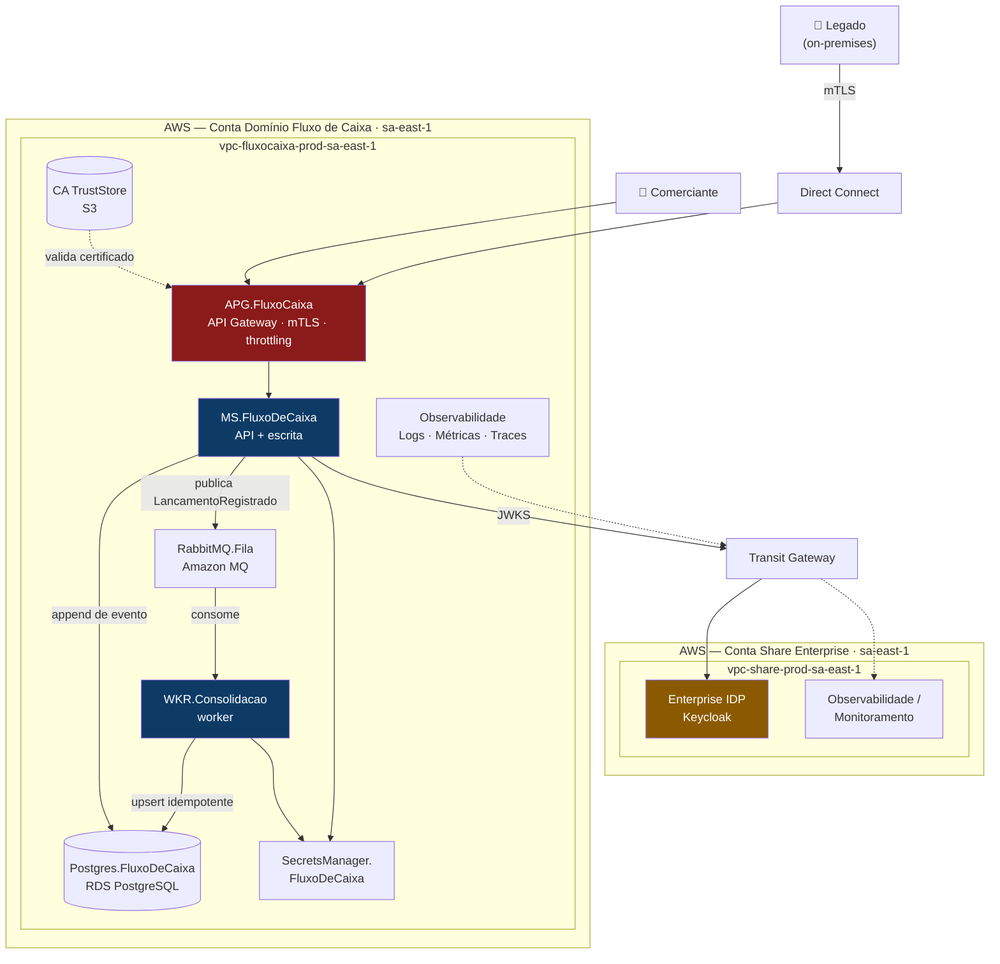
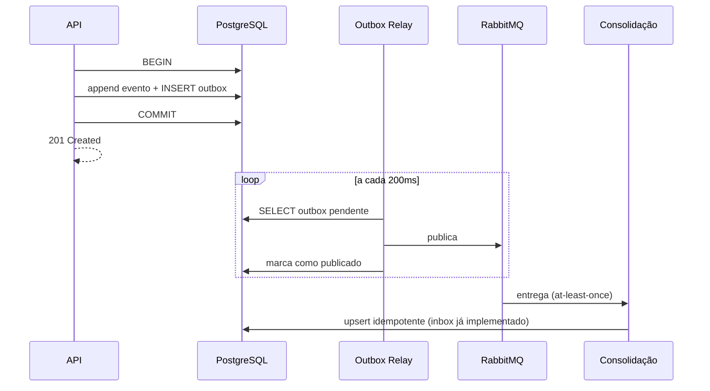

# Arquitetura Alvo

O que está no repositório é a **arquitetura implementada** (Docker Compose, dois serviços). Este documento descreve a **arquitetura alvo** — como o sistema roda em produção sob SLA — e o que muda para chegar lá.

Para os diagramas C4 da solução atual e os ADRs, ver [../ARCHITECTURE.md](../ARCHITECTURE.md).

---

## 1. Arquitetura alvo (produção, AWS)

A topologia alvo segrega **capacidades corporativas** (identidade, observabilidade) de **capacidades de domínio** (fluxo de caixa) em contas AWS distintas — ver [ADR-12](../ARCHITECTURE.md#adr-12-segregação-em-múltiplas-contas-aws).

> **Multi-AZ:** o diagrama mostra a topologia lógica. Para o SLO de 99,9%, RDS, Amazon MQ e as tasks do ECS devem estar distribuídos em **pelo menos duas Availability Zones** — ver [DECISOES-ARQUITETURAIS.md](DECISOES-ARQUITETURAIS.md#7-observações-sobre-o-desenho-alvo).

### O que muda em relação ao que está implementado

| Aspecto | Hoje (desafio) | Alvo (produção) | Por quê |
|---|---|---|---|
| Contas AWS | Nenhuma (tudo local) | **Duas**: Share Enterprise e Domínio | Fronteira de conta espelha fronteira de *bounded context*; contém *blast radius* e atribui custo (ADR-12) |
| Entrada | API exposta direto | **API Gateway** com mTLS e CA TrustStore | Ponto único de entrada; autentica o legado por certificado, não por segredo estático (ADR-14) |
| Conectividade | Rede do Docker | **Transit Gateway** (entre contas) + **Direct Connect** (on-premises) | Tráfego de identidade e integração nunca passa pela internet pública (ADR-17) |
| Deploy | ✅ **Já separado**: `MS.FluxoDeCaixa` + `WKR.Consolidacao` (containers distintos) | Os mesmos dois serviços, em tasks ECS com autoscaling próprio | Escalam por gatilhos diferentes: escrita por RPS, consolidação por lag da fila (ADR-15) |
| Banco | Uma instância PostgreSQL | RDS Multi-AZ + read replica para o consolidado | Falha de AZ não derruba o negócio; leitura de pico não compete com a escrita |
| Broker | Container RabbitMQ único | Amazon MQ em cluster multi-AZ | O broker vira SPOF sem cluster |
| Publicação de evento | Persist-then-publish (ADR-04) | **Outbox transacional** | Fecha a janela em que o evento é gravado e a publicação falha |
| Cache | Nenhum | Redis no consolidado (TTL 5–10s) | Reduz carga no banco no pico; a consistência já é eventual |
| Identidade | **Keycloak** como container do projeto (`start-dev`, H2, HTTP) | **Enterprise IDP Keycloak** na conta Share Enterprise, compartilhado por todos os domínios | Evita um IdP por aplicação e fragmentação de identidade; habilita SSO corporativo. Nada muda no código — só o `Keycloak:Authority` (ADR-13) |
| Segredos | Variável de ambiente | **AWS Secrets Manager** com rotação, lido via IAM role da task | Variável de ambiente aparece em descrição de task e log de deploy, e não rotaciona (ADR-16) |
| Schema | DDL idempotente no startup | Migrations versionadas (DbUp) em step do pipeline | Startup não é lugar de DDL com múltiplas instâncias subindo em paralelo |
| Observabilidade | Serilog JSON + correlation id | OpenTelemetry (traces, métricas, logs) | Ver [OBSERVABILIDADE.md](OBSERVABILIDADE.md) |

### Dimensionamento para o RNF de 50 req/s

| Componente | Configuração | Folga |
|---|---|---|
| ECS Consolidação | 2 tasks (0,5 vCPU / 1 GB), autoscale até 20 | Cada task sustenta ~200 req/s numa leitura por PK; 2 tasks = ~8× o pico exigido |
| RDS | `db.t4g.medium` Multi-AZ | A leitura é `SELECT` por chave primária, não agregação |
| Redis | `cache.t4g.micro` | Absorve a leitura repetida do mesmo dia |
| Amazon MQ | `mq.t3.micro` cluster | A escrita é muito inferior à leitura |

> A meta de erro do enunciado é ≤ 5%. O alvo operacional interno é **≤ 0,1%**, com o 5% servindo apenas como limite de degradação aceitável em incidente.

### Outbox transacional (a principal evolução)

Hoje, o evento é gravado no Marten e depois publicado no RabbitMQ (ADR-04). Se o processo morrer entre as duas operações, o lançamento existe mas o consolidado não o reflete — e não há reconciliação automática.

Na arquitetura alvo, a gravação do evento e a da mensagem de saída acontecem **na mesma transação**, e um relay publica a partir da tabela de outbox:

O MassTransit já suporta isso via `AddEntityFrameworkOutbox` / outbox do Marten. O **lado consumidor da garantia já está implementado**: a tabela `lancamentos_consolidados` torna a reentrega segura, que é a metade mais fácil de errar.

---

## 2. Evolução por horizonte

| Horizonte | Entregas |
|---|---|
| **Curto** (0–3 meses) | Outbox transacional; migrations versionadas; OpenTelemetry; RDS Multi-AZ |
| **Médio** (3–9 meses) | Keycloak em modo produção (PostgreSQL dedicado + TLS + cluster); MFA; cache Redis; consolidado por período; estorno e fechamento de dia; read replica dedicada |
| **Longo** (9+ meses) | Projeções analíticas (previsão de fluxo); multi-moeda; particionamento do event store por período |
