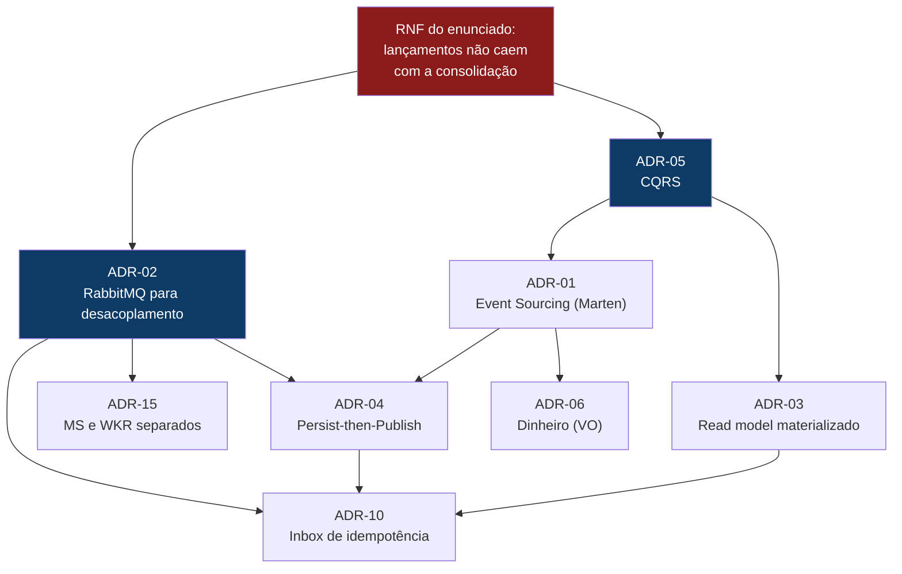
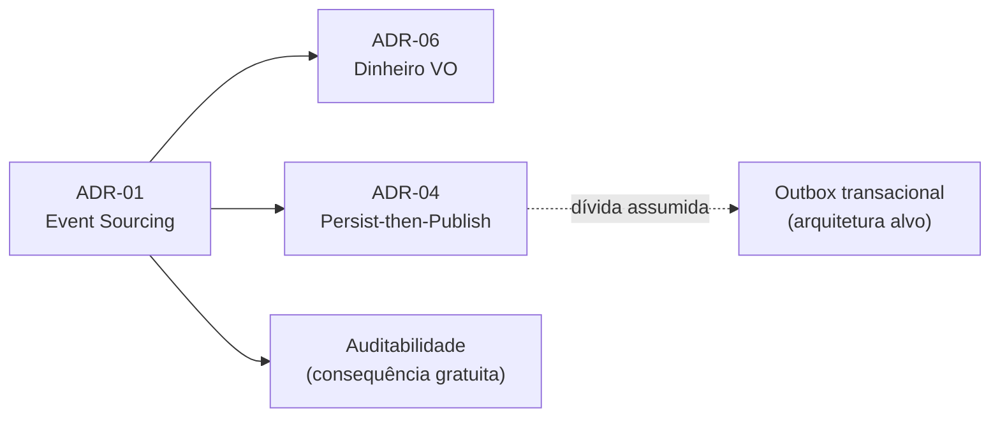
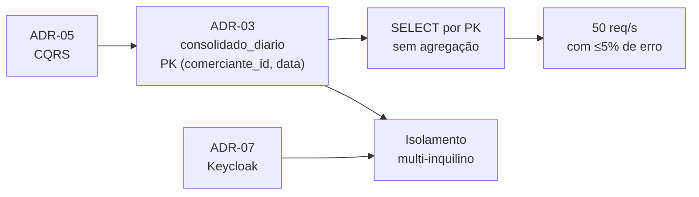
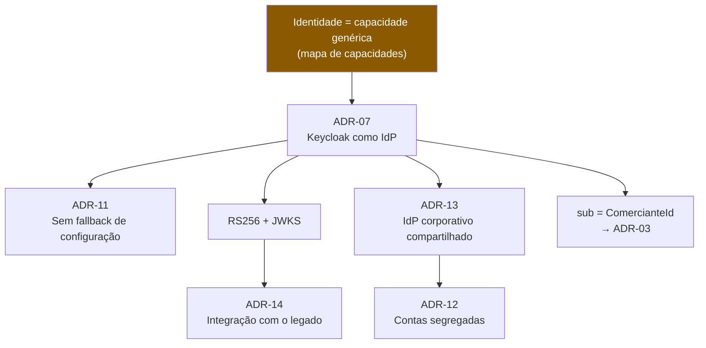
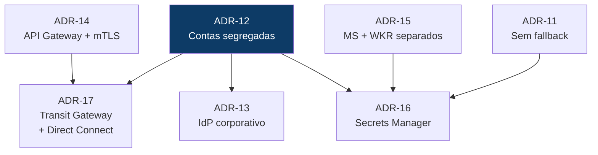

# Decisões Arquiteturais — Mapa e Encadeamento

Os [ADRs](../ARCHITECTURE.md#decisões-arquiteturais-adrs) registram cada decisão isoladamente: contexto, escolha, consequências. Este documento responde a outra pergunta — **como elas se sustentam umas nas outras**.

Arquitetura não é uma lista de escolhas independentes. É uma cadeia: uma decisão cria a condição para a próxima e fecha a porta para outras. Ler os ADRs em sequência mostra *o que* foi decidido; este mapa mostra *por que cada uma tornou a seguinte necessária*.

---

## 1. A decisão que origina todas as outras

Todo o desenho parte de **uma única frase do enunciado**:

> *"O serviço de controle de lançamento não deve ficar indisponível se o sistema de consolidado diário cair."*

Essa frase parece um requisito de infraestrutura. Não é — é uma afirmação sobre **fronteira de domínio**. Ela diz que registrar um lançamento e consultar o saldo consolidado têm **criticidades diferentes**:

| | Se ficar indisponível | Consistência tolerada | Perfil de carga |
|---|---|---|---|
| **Registrar lançamento** | O comerciante **não vende** — perda de dinheiro | Forte: o fato precisa estar gravado antes do `201` | Escrita moderada e constante |
| **Consultar consolidado** | O comerciante **não vê o resumo** — incômodo | Eventual: < 1s é aceitável | Leitura em pico (50 req/s) |

Dois domínios com criticidade assimétrica **não podem compartilhar destino**. Daí decorre tudo:

**Leitura do grafo:** o RNF força o desacoplamento assíncrono (ADR-02). Desacoplar por mensageria obriga a decidir *quando* publicar (ADR-04) e a tratar entrega duplicada (ADR-10). Separar leitura de escrita (ADR-05) permite que cada lado use o modelo de dados que lhe convém — append-only na escrita (ADR-01), tabela materializada na leitura (ADR-03).

> **O ponto que costuma passar despercebido:** o desacoplamento não foi escolhido porque "microsserviços são modernos". Foi a **única forma** de cumprir o requisito. Qualquer chamada HTTP de Lançamentos para Consolidação acoplaria a disponibilidade do domínio crítico à do secundário — exatamente o que o enunciado proíbe.

---

## 2. As quatro cadeias de decisão

### Cadeia A — Persistência e integridade do dado financeiro

| Decisão | Depende de | Habilita | Custo que impõe |
|---|---|---|---|
| **ADR-01** Event Sourcing | — | Imutabilidade, auditoria, replay | Complexidade de leitura → exige ADR-03 |
| **ADR-06** `Dinheiro` como VO | ADR-01 (evento precisa de tipo preciso) | Precisão decimal, operações type-safe | Nenhum relevante |
| **ADR-04** Persist-then-Publish | ADR-01 + ADR-02 | Evento nunca se perde | **Janela de inconsistência** se a publicação falhar |

**A dívida explícita:** o ADR-04 admite que, se o processo morrer entre persistir e publicar, o consolidado fica desatualizado sem reconciliação automática. É a única dívida técnica **assumida por escolha** neste desenho, e está endereçada na [arquitetura alvo](ARQUITETURA-ALVO.md) via outbox transacional. O lado difícil da garantia — a idempotência do consumidor — **já está implementado** (ADR-10).

### Cadeia B — Leitura, escala e o RNF de 50 req/s

O segundo RNF do enunciado — *50 requisições por segundo com no máximo 5% de perda* — é atendido por uma escolha de **modelo de dados**, não de infraestrutura. Como o consolidado é materializado a cada evento, a consulta é um `SELECT` por chave primária: sem `SUM`, sem `GROUP BY`, sem varrer o event store. Escalar vira questão de adicionar réplicas de leitura, não de otimizar query.

**O cruzamento importante:** a chave primária `(comerciante_id, data)` serve a **dois propósitos ao mesmo tempo** — desempenho previsível *e* isolamento entre comerciantes no nível do schema. O `comerciante_id` vem da claim `sub` do token (ADR-07), nunca do corpo da requisição. É onde a decisão de identidade e a decisão de modelagem de dados se encontram.

### Cadeia C — Identidade

Esta cadeia começa **antes da tecnologia**: no [mapa de capacidades](DOMINIOS-E-CAPACIDADES.md#2-mapa-de-capacidades-de-negócio), identidade foi classificada como **capacidade genérica** — não é onde o negócio se diferencia. Dessa classificação decorre "comprar em vez de construir", e só então "Keycloak".

A primeira versão do projeto fez o contrário: construiu autenticação própria (tabela `usuarios`, BCrypt, JWT HS256). Funcionava, mas carregava quatro dívidas que **nenhuma delas era corrigível sem trocar a decisão de base**: sem revogação, HS256 impedindo validação por terceiros, sem MFA, sem política de senha.

Trocar para um IdP fechou as quatro de uma vez — e habilitou duas decisões que seriam impossíveis antes:

- **RS256 com JWKS** torna viável o ADR-14: um parceiro valida o token sem jamais receber a chave que assina. Com HS256 isso era estruturalmente impossível.
- **Protocolo OIDC padrão** torna o ADR-13 quase gratuito: promover o IdP a serviço corporativo é mudar `Keycloak:Authority` de host, não reescrever código.

> **O teste de uma boa decisão de fronteira:** o ADR-13 move o IdP para outra conta AWS e **nenhuma linha de código muda**. Isso só é verdade porque o acoplamento foi feito ao protocolo, não ao produto.

### Cadeia D — Plataforma (arquitetura alvo)

A decisão estruturante aqui é o **ADR-12** (contas segregadas), e ela é uma decisão de *fronteira organizacional* espelhando a fronteira de domínio. Tudo o mais decorre: contas separadas exigem conectividade explícita (ADR-17); o IdP corporativo só faz sentido numa conta compartilhada (ADR-13); credenciais entre contas pedem gestão formal (ADR-16).

O **ADR-15** merece nota. Ele *não* é necessário para cumprir o RNF — o desacoplamento assíncrono já o cumpre, e isso está provado por teste. O ADR-15 existe por uma razão diferente: **escala com gatilhos distintos**. Escrita escala por RPS; consolidação, por profundidade de fila. É por isso que ele aparece como decisão de *plataforma*, não de domínio — e por isso separar os processos foi deliberadamente adiado no escopo do desafio, onde adicionaria custo operacional sem provar nada novo.

---

## 3. Onde cada decisão aparece na arquitetura alvo

Mapeamento direto entre os componentes do diagrama e os ADRs que os justificam:

| Componente | ADR | Decisão que o originou |
|---|---|---|
| **Conta Share Enterprise** / **Conta Domínio** | ADR-12 | Fronteira de conta espelha fronteira de *bounded context* |
| `Enterprise IDP Keycloak` | ADR-07, ADR-13 | Identidade é capacidade genérica → comprar e compartilhar |
| `Carrefour.APG.FluxoCaixa` | ADR-14 | Ponto único de entrada; *throttling* e validação na borda |
| `CA TrustStore` + **mTLS** | ADR-14 | Autenticar o legado por certificado, não por segredo estático |
| `Carrefour.MS.FluxoDeCaixa` | ADR-01, 04, 05, 06, 15 | Caminho de escrita: Event Sourcing + CQRS |
| `Carrefour.WKR.FluxoDeCaixaConsolidacao` | ADR-02, 03, 10, 15 | Consumidor assíncrono idempotente que materializa o read model |
| `Carrefour.RabbitMQ.Fila` | ADR-02 | Desacoplamento que cumpre o RNF do enunciado |
| `Carrefour.Postgres.FluxoDeCaixa` | ADR-01, 03 | Event store *e* read model no mesmo motor |
| `Carrefour.SecretsManager.FluxoDeCaixa` | ADR-11, ADR-16 | Nenhuma credencial em código ou variável de ambiente |
| `Transit Gateway` / `Direct Connect` | ADR-17 | Tráfego de identidade e integração fora da internet pública |
| **Observabilidade** (ambas as contas) | — | Ver [OBSERVABILIDADE.md](OBSERVABILIDADE.md) |
| `Legado` (on-premises) | ADR-14 | Consumidor externo autenticado por mTLS; ver [arquitetura de transição](ARQUITETURA-ALVO.md#2-arquitetura-de-transição) |

---

## 4. Como cada requisito do enunciado é rastreado até uma decisão

| Requisito | Decisões que o atendem | Evidência |
|---|---|---|
| Serviço de controle de lançamentos | ADR-01, ADR-05, ADR-06 | `RegistrarLancamentoHandlerTests` |
| Serviço de consolidado diário | ADR-02, ADR-03 | `LancamentoConsolidadoFlowTests` |
| **Lançamentos não caem com a consolidação** | **ADR-02**, ADR-04, ADR-10, ADR-15 | `Escrita_permanece_disponivel_independente_da_consolidacao` |
| **50 req/s com ≤ 5% de perda** | **ADR-03**, ADR-05 | `ConsolidadoLoadTests` (NBomber) |
| Mapeamento de domínios e capacidades | — | [DOMINIOS-E-CAPACIDADES.md](DOMINIOS-E-CAPACIDADES.md) |
| Arquitetura alvo | ADR-12 a ADR-17 | [ARQUITETURA-ALVO.md](ARQUITETURA-ALVO.md) |
| Arquitetura de transição | ADR-14, ADR-17 | [ARQUITETURA-ALVO.md](ARQUITETURA-ALVO.md#2-arquitetura-de-transição) |
| Estimativa de custos | ADR-12, ADR-15, ADR-16 | [CUSTOS.md](CUSTOS.md) |
| Observabilidade | — | [OBSERVABILIDADE.md](OBSERVABILIDADE.md) |
| **Critérios de segurança para integração** | **ADR-14**, ADR-07, ADR-16 | [SEGURANCA.md](SEGURANCA.md) |

---

## 5. Decisões revisadas — e por quê

Um ADR que nunca é revisto costuma indicar que ninguém o releu. Duas decisões deste projeto mudaram durante sua construção, e o registro dessas mudanças vale mais que a decisão final:

| Decisão original | Substituída por | Motivo |
|---|---|---|
| Autenticação própria (tabela `usuarios`, BCrypt, JWT HS256) | **ADR-07** — Keycloak | Quatro lacunas de segurança não eram corrigíveis sem trocar a decisão de base. A classificação de identidade como capacidade *genérica* já apontava para isso desde o mapa de capacidades |
| Consolidado com PK apenas em `data` | **ADR-03** — PK `(comerciante_id, data)` | Defeito real: o saldo de todos os comerciantes era somado numa linha só, e qualquer um via o total dos demais. Detectado em revisão, corrigido e coberto por teste de isolamento |

Ambas seguem o mesmo padrão: **a decisão errada não era um detalhe de implementação, era uma fronteira mal traçada**. Corrigi-las exigiu voltar ao mapa de capacidades, não ao código.

---

## 6. Trade-offs assumidos conscientemente

Nenhuma arquitetura é só benefício. O que este desenho paga em troca:

| Escolha | O que ganha | O que custa |
|---|---|---|
| Event Sourcing (ADR-01) | Auditabilidade e imutabilidade nativas | Curva de aprendizado; leitura exige projeção |
| Mensageria (ADR-02) | Disponibilidade da escrita independente da leitura | **Consistência eventual** — o saldo pode ficar < 1s atrasado |
| Persist-then-Publish (ADR-04) | Simplicidade, sem outbox | Janela de inconsistência se a publicação falhar |
| Monólito modular no escopo do desafio | Menos custo operacional para avaliar | Não demonstra escala independente (resolvido no ADR-15) |
| IdP externo (ADR-07/13) | Segurança de mercado, zero credencial na aplicação | Dependência de runtime; se o IdP cai, ninguém autentica |
| Contas segregadas (ADR-12) | *Blast radius* e custo por domínio | Dobra a superfície operacional |
| mTLS para o legado (ADR-14) | Autenticação forte, sem segredo compartilhado | Gestão de ciclo de vida de certificados |

---

## 7. Observações sobre o desenho alvo

Três pontos que eu levantaria numa revisão de arquitetura, para decisão explícita e não por omissão:

1. **Multi-AZ.** O diagrama mostra uma Availability Zone por VPC. Para o SLO de 99,9% proposto em [OBSERVABILIDADE.md](OBSERVABILIDADE.md), RDS, Amazon MQ e as tasks do ECS precisam estar em **pelo menos duas AZs** — uma falha de zona não pode derrubar o domínio.

2. **O IdP vira dependência crítica compartilhada.** Com o ADR-13, uma indisponibilidade do Keycloak corporativo impede login em *todos* os domínios. Tokens já emitidos continuam válidos até expirar (15 min), o que dá alguma folga, mas o IdP precisa de SLA e HA à altura do sistema mais crítico que o consome — não à altura da média.

3. **O gateway concentra risco.** Com todo o tráfego externo passando pelo `APG`, ele é ponto único de falha e alvo preferencial. Configuração versionada, HA e um WAF à frente deixam de ser opcionais.

---

## Referências

- [../ARCHITECTURE.md](../ARCHITECTURE.md) — ADRs completos, diagramas C4 e de sequência
- [DOMINIOS-E-CAPACIDADES.md](DOMINIOS-E-CAPACIDADES.md) — mapa de capacidades e *bounded contexts*
- [ARQUITETURA-ALVO.md](ARQUITETURA-ALVO.md) — arquitetura alvo e de transição
- [REQUISITOS.md](REQUISITOS.md) — requisitos funcionais e não funcionais refinados
- [SEGURANCA.md](SEGURANCA.md) · [OBSERVABILIDADE.md](OBSERVABILIDADE.md) · [CUSTOS.md](CUSTOS.md)
