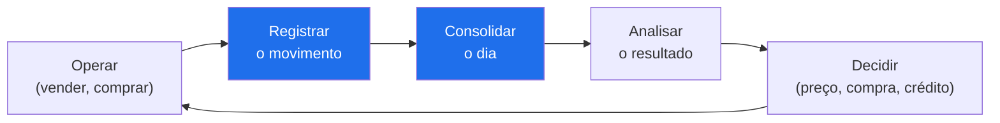
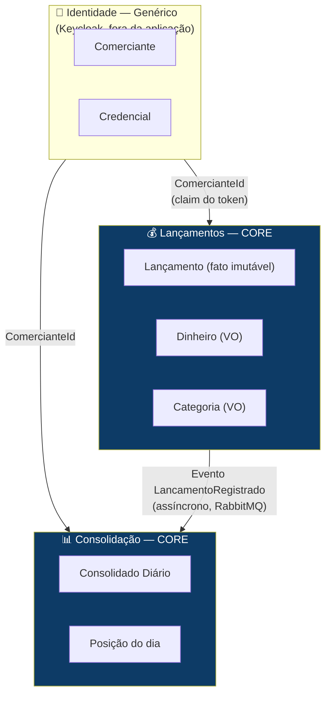

# Domínios Funcionais e Capacidades de Negócio

Este documento mapeia o problema **antes** da solução técnica: quais capacidades o comerciante precisa, em que domínios elas se agrupam, quais são centrais ao negócio e quais são commodity — e só então como esses domínios viram serviços e componentes.

> **Por que isso primeiro:** a decomposição em serviços não vem da tecnologia, vem da fronteira do domínio. O requisito não-funcional do desafio ("o controle de lançamentos não pode cair junto com o consolidado") é, na prática, uma afirmação sobre **fronteira de domínio**: são dois domínios com criticidade e perfil de carga diferentes, logo não podem compartilhar destino.

---

## 1. Cadeia de valor do comerciante

O negócio do comerciante não é "registrar lançamento". É **saber se o dia fechou no azul e decidir com base nisso**. O registro é meio; a decisão é o valor.

Os dois passos em destaque são o escopo deste desafio. Os demais delimitam o contexto e orientam a evolução (seção 6).

---

## 2. Mapa de capacidades de negócio

Capacidade = **o que** o negócio precisa ser capaz de fazer, independente de como é implementado.

| # | Capacidade | Descrição | Criticidade | Classificação |
|---|---|---|---|---|
| C1 | **Registro de Movimento Financeiro** | Capturar débitos e créditos de forma confiável e imutável | 🔴 Crítica | **Core** |
| C2 | **Consolidação de Posição Diária** | Apurar totais e saldo líquido do dia | 🟠 Alta | **Core** |
| C3 | **Classificação de Movimento** | Categorizar o lançamento para análise posterior | 🟡 Média | Suporte |
| C4 | **Consulta de Extrato** | Listar os movimentos de um período | 🟠 Alta | Suporte |
| C5 | **Identidade do Comerciante** | Autenticar e isolar os dados de cada comerciante | 🔴 Crítica | Genérica |
| C6 | **Rastreabilidade e Auditoria** | Reconstruir como se chegou a qualquer saldo | 🟠 Alta | Suporte |

**Como a classificação dirigiu as decisões:**

- **Core (C1, C2)** — recebem o maior investimento arquitetural: Event Sourcing para C1 (imutabilidade e auditabilidade do fato financeiro), read model materializado para C2 (leitura previsível sob pico). São os domínios que justificam a complexidade.
- **Suporte (C3, C4, C6)** — resolvidos por composição do que já existe. C6 é consequência gratuita do Event Sourcing escolhido para C1, não um esforço separado.
- **Genérica (C5)** — **comprada, não construída**: delegada ao Keycloak (OIDC). Identidade não é onde este negócio se diferencia, e construí-la significaria reimplementar mal o que um IdP entrega pronto — MFA, política de senha, revogação, recuperação de conta, rotação de chaves. A aplicação não guarda nenhuma credencial. Ver [ADR-07](../ARCHITECTURE.md#adr-07-keycloak-como-identity-provider-oidc).

---

## 3. Domínios funcionais e bounded contexts

As capacidades se agrupam em três contextos delimitados, com linguagem ubíqua própria:

### Linguagem ubíqua por contexto

| Contexto | Termos | Fato central | Invariantes |
|---|---|---|---|
| **Lançamentos** | Lançamento, Débito, Crédito, Dinheiro, Categoria | `LancamentoRegistrado` | Valor > 0; tipo ∈ {Débito, Crédito}; lançamento nunca é alterado ou apagado |
| **Consolidação** | Consolidado Diário, Total de Créditos, Total de Débitos, Saldo Líquido | `ConsolidadoAtualizado` | Saldo = Créditos − Débitos; escopo sempre (comerciante, data); aplicação idempotente |
| **Identidade** *(Keycloak)* | Comerciante, Credencial, Token, Realm, Cliente | `ComercianteRegistrado` | E-mail único; a senha nunca trafega nem repousa na aplicação |

### Relacionamento entre contextos (Context Mapping)

| Upstream → Downstream | Padrão DDD | Por quê |
|---|---|---|
| Identidade → Lançamentos / Consolidação | **Conformist** | Os dois consomem o `ComercianteId` da claim `sub` sem traduzir. O contrato do token é simples e estável |
| Lançamentos → Consolidação | **Published Language** (evento) + **Customer/Supplier** | O evento `LancamentoRegistrado` é o contrato publicado. Consolidação assina; **nunca** consulta Lançamentos de forma síncrona — é essa escolha que cumpre o RNF de disponibilidade |

> **Anti-Corruption Layer:** não há ACL hoje porque não há legado a integrar. É exatamente onde ela entraria na arquitetura de transição — ver [ARQUITETURA-ALVO.md](ARQUITETURA-ALVO.md#2-arquitetura-de-transição).

---

## 4. Da fronteira de domínio à fronteira de serviço

O RNF do desafio — *"o serviço de controle de lançamento não deve ficar indisponível se o sistema de consolidado diário cair"* — é o critério que define onde cortar:

| Domínio | Perfil de carga | Consistência | Se cair… | Consequência arquitetural |
|---|---|---|---|---|
| **Lançamentos** | Escrita moderada, constante | Forte (o fato precisa estar gravado antes do 201) | O comerciante **não consegue vender** — perda de dinheiro | Caminho de escrita curto, sem dependência de rede além do próprio banco |
| **Consolidação** | Leitura em pico (50 req/s) | Eventual (< 1s é aceitável) | O comerciante **não vê o resumo** — incômodo, não perda | Read model materializado, escalável horizontalmente, alimentado por fila |

**A conclusão que isso força:** os dois domínios não podem se comunicar de forma síncrona. Qualquer chamada HTTP de Lançamentos para Consolidação acoplaria a disponibilidade do domínio crítico à do domínio secundário — exatamente o que o requisito proíbe. Daí o broker de mensagens, e não uma chamada direta.

### Mapeamento domínio → componente

| Domínio / Capacidade | Projeto .NET | Guarda o quê |
|---|---|---|
| Lançamentos (C1, C3, C6) | `FluxoDeCaixa.Domain` + `.Application` + `.Infrastructure` | Event store (Marten/PostgreSQL) — fonte da verdade |
| Consolidação (C2) | `FluxoDeCaixa.Consolidacao` | Read model `consolidado_diario` + inbox de idempotência |
| Identidade (C5) | **Keycloak** (fora da aplicação) | Usuários, credenciais e chaves de assinatura no realm `fluxocaixa` |
| Extrato (C4) | `FluxoDeCaixa.Application/Consultas` | Projeção de documentos do Marten |
| Apresentação | `FluxoDeCaixa.Web` (Blazor WASM) | — |

> **Nota honesta sobre o deploy atual:** os dois domínios core estão logicamente separados (projetos, contratos e armazenamentos distintos) mas rodam no **mesmo processo** — um monólito modular. O desacoplamento que o RNF exige é real, porque a comunicação já é assíncrona via broker: derrubar o consumer não derruba a escrita. Extrair a Consolidação para um serviço próprio é uma mudança de deploy, não de código — o caminho está em [ARQUITETURA-ALVO.md](ARQUITETURA-ALVO.md). Fiz essa escolha deliberadamente: separar processos no escopo do desafio adicionaria custo operacional sem provar nada que o broker já não prove.

---

## 5. Isolamento entre comerciantes

Toda capacidade de negócio deste sistema é **escopada ao comerciante**. Essa é uma regra de domínio, não um detalhe de implementação, e por isso aparece em três camadas:

| Camada | Mecanismo |
|---|---|
| Entrada | `ComercianteId` extraído da claim `sub` do JWT — nunca aceito via body ou query |
| Domínio | `ComercianteId` é parte do evento `LancamentoRegistrado` |
| Dados | `consolidado_diario` tem chave primária `(comerciante_id, data)`; toda consulta de extrato filtra por comerciante |

Coberto pelos testes `Consolidado_de_um_comerciante_nao_vaza_para_outro` e `Consolidado_e_isolado_por_comerciante`.

---

## 6. Capacidades não implementadas (e por quê)

Escopo é decisão de arquitetura. Estas capacidades foram identificadas, avaliadas e **conscientemente deixadas de fora**:

| Capacidade | Valor | Por que ficou fora | Quando entraria |
|---|---|---|---|
| Consolidado por período (semana/mês) | Alto | A projeção diária já é o bloco de construção; agregar é incremento pequeno | Próxima iteração |
| Estorno / lançamento compensatório | Alto | Exige regra de negócio sobre reabertura de dia fechado — modelagem maior que o tempo disponível | Antes de produção |
| Fechamento de dia (imutabilidade após D+1) | Alto | Depende de estorno para fazer sentido | Antes de produção |
| Multi-moeda | Médio | `Dinheiro` já carrega `Moeda`, mas conversão exige taxas e política de arredondamento | Sob demanda |
| Previsão de fluxo de caixa | Alto | É outro domínio (analítico), com outro perfil de dados | Roadmap |
| ~~IdP gerenciado~~ | — | **Implementado** — Keycloak 26, realm versionado no repositório | ✅ Feito |
| MFA (OTP) | Médio | Suportado pelo Keycloak; não ativado para não atrapalhar a avaliação | Antes de produção |

---

## Referências

- [ARQUITETURA-ALVO.md](ARQUITETURA-ALVO.md) — arquitetura alvo em nuvem e de transição
- [REQUISITOS.md](REQUISITOS.md) — requisitos funcionais e não funcionais refinados
- [../ARCHITECTURE.md](../ARCHITECTURE.md) — diagramas C4, sequência e ADRs
