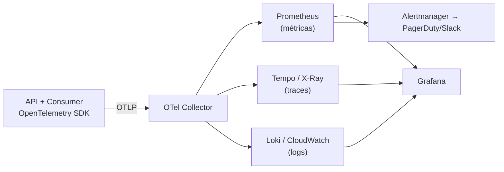

# Monitoramento e Observabilidade

O que está **implementado** no repositório e o que é **plano** para a arquitetura alvo, separados explicitamente.

---

## 1. Implementado

### Logs estruturados com correlação

Serilog com `JsonFormatter` — toda linha é JSON consultável, não texto livre. O `CorrelationIdMiddleware` aceita um `X-Correlation-Id` recebido ou gera um novo, devolve no response e o enriquece no `LogContext`, de modo que o id acompanha a requisição HTTP, a publicação do evento e o processamento no consumer.

```json
{"Timestamp":"2026-04-14T19:30:02.11Z","Level":"Information",
 "MessageTemplate":"Consolidando lançamento {LancamentoId} para data {Data}",
 "LancamentoId":"3fa85f64-...","Data":"2026-04-14","CorrelationId":"a1b2c3d4"}
```

### Health probes

| Endpoint | Verifica | Uso |
|---|---|---|
| `GET /health/live` | Processo vivo | Liveness probe — reinicia a instância travada |
| `GET /health/ready` | Conectividade com o PostgreSQL (`SELECT 1`) | Readiness probe — só recebe tráfego quando consegue atender |

Consumido pelo healthcheck do `compose.yaml` (o `web` só sobe depois da API ficar saudável) e pelo smoke test do CI.

### Erros observáveis

Todo erro responde em ProblemDetails (RFC 7807). O `500` carrega o `correlationId` no corpo: o comerciante informa o id ao suporte e o log é localizado em uma consulta.

### Rastreabilidade de negócio

O event store append-only é a trilha de auditoria: qualquer saldo pode ser reconstruído a partir dos eventos que o formaram. Isso é observabilidade de **domínio**, não de infraestrutura — e é o que uma auditoria financeira pede.

---

## 2. Plano — OpenTelemetry

Instrumentação unificada (traces, métricas e logs) exportando por OTLP, sem acoplar a aplicação a um fornecedor.



Instrumentação automática disponível para ASP.NET Core, Npgsql, MassTransit e HttpClient — o trace nasce no `POST /lancamentos`, atravessa o RabbitMQ pelo contexto propagado e termina no `UPSERT` do consumer, mostrando o salto assíncrono em uma única linha do tempo.

### Métricas de negócio (as que realmente importam)

| Métrica | Tipo | Por que | Alerta |
|---|---|---|---|
| `fluxocaixa.lancamentos.registrados` | Counter | Volume por tipo e categoria | Queda > 50% vs. mesma hora da semana anterior |
| `fluxocaixa.consolidacao.lag` | Histogram | **Tempo entre o `201` e o saldo atualizado** — mede a consistência eventual prometida | p95 > 5s por 5 min |
| `fluxocaixa.consolidacao.fila.profundidade` | Gauge | Mensagens não processadas | > 1.000 por 5 min |
| `fluxocaixa.consolidacao.erro_queue` | Counter | Mensagens que esgotaram os retries | **> 0 — sempre** |
| `fluxocaixa.consolidado.requisicoes` | Counter | Verifica o RNF de 50 req/s em produção | Taxa de erro > 1% |

> O `consolidacao.lag` é a métrica central do sistema: é ela que transforma a promessa "< 1s" do ADR-02 em algo verificável em produção, e não em uma afirmação de documento.

### Métricas técnicas

Latência por endpoint (p50/p95/p99), taxa de erro por status, pool de conexões do Npgsql, CPU/memória por task, e a saúde do RabbitMQ (conexões, unacked, consumers ativos).

### SLIs e SLOs propostos

| SLI | SLO | Janela | Orçamento de erro |
|---|---|---|---|
| Disponibilidade do registro de lançamentos | 99,9% | 30 dias | 43 min/mês |
| Disponibilidade da consulta de consolidado | 99,5% | 30 dias | 3,6 h/mês |
| Latência p95 do `POST /lancamentos` | < 200 ms | 7 dias | 5% |
| Latência p95 do `GET /consolidado/diario` | < 100 ms | 7 dias | 5% |
| Lag de consolidação p95 | < 1 s | 7 dias | 5% |
| Perda no consolidado sob pico | < 5% *(enunciado)*; alvo interno < 0,1% | pico | — |

O SLO do registro é mais rigoroso que o do consolidado **de propósito**: é a mesma assimetria de criticidade que motivou a separação dos domínios. Se a consolidação consumir o orçamento de erro, o registro continua dentro do seu.

### Alertas — apenas o que exige ação humana

| Alerta | Condição | Severidade |
|---|---|---|
| Registro de lançamentos indisponível | `/health/ready` falhando em > 50% das tasks por 2 min | **P1 — acorda alguém** |
| Mensagens na error queue | `> 0` | **P1** — indica dinheiro não consolidado |
| Lag de consolidação alto | p95 > 5s por 5 min | P2 |
| Fila crescendo | profundidade > 1.000 por 5 min | P2 |
| Orçamento de erro do SLO em 50% | burn rate | P3 |

Alerta que não leva a uma ação vira ruído e treina o time a ignorar o painel — por isso a lista é curta.

### Painéis

1. **Negócio** — lançamentos por hora/categoria, saldo agregado, comerciantes ativos
2. **SLO** — consumo do orçamento de erro, latências, disponibilidade
3. **Pipeline assíncrono** — profundidade da fila, lag, retries, error queue
4. **Infraestrutura** — CPU/memória, conexões do banco, saúde do broker

---

## 3. Roteiro de adoção

| Fase | Entrega | Esforço |
|---|---|---|
| 1 | Pacotes OpenTelemetry + instrumentação automática + OTLP | ~1 dia |
| 2 | Métricas de negócio customizadas (`Meter` no consumer e nos handlers) | ~2 dias |
| 3 | Painéis Grafana e alertas | ~2 dias |
| 4 | SLOs formalizados com orçamento de erro | ~1 dia |
